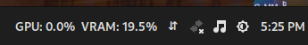

# Cinnamon Intel GPU Monitor
An applet to monitor Intel GPU statistics



## Requirements

```bash
sudo apt install intel-gpu-tools
```

## Usage
- Run the install.sh script
- Right click on the panel and select Applets
- Add the Appletto the panel by selecting it and clicking on the bottom + button
